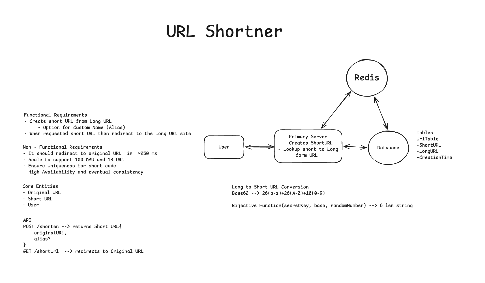
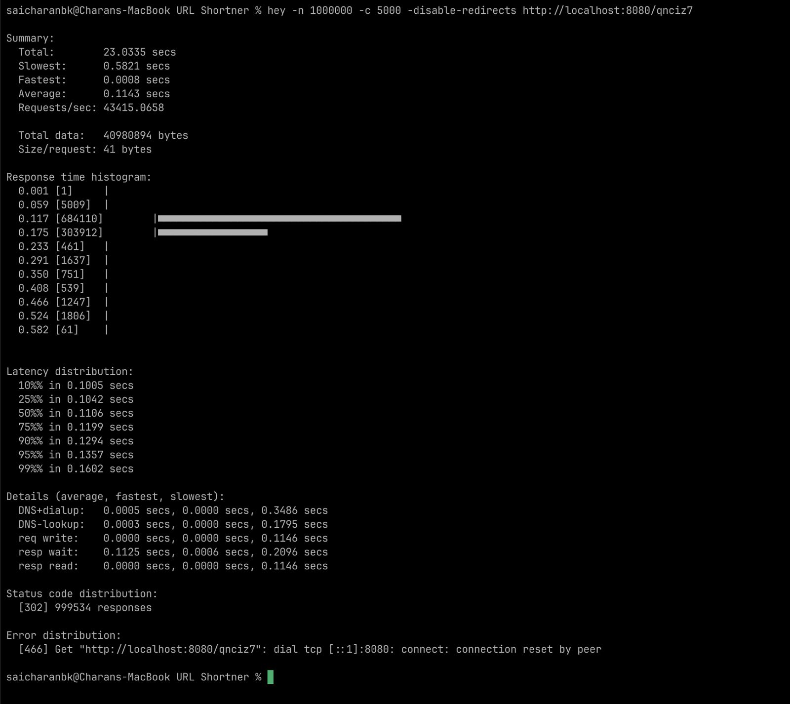
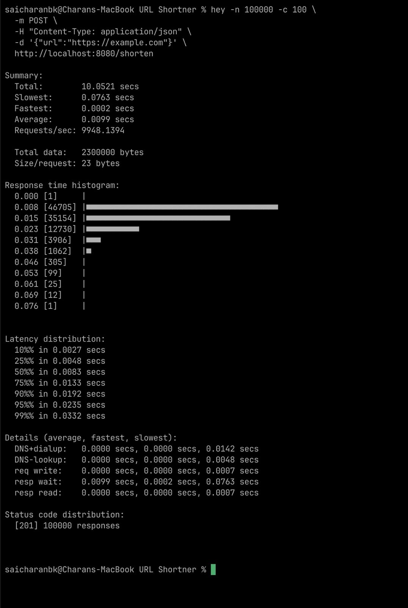
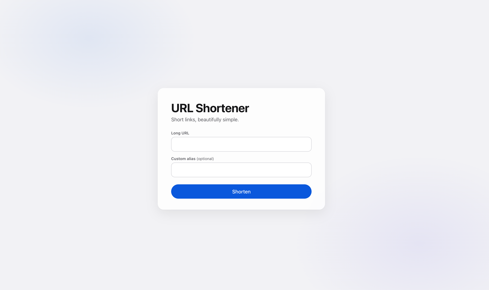

# URL Shortener
  

## What it is

A self-hosted URL shortener. Paste a long URL, get a short link back — either an auto-generated 6-character code or a custom alias you choose (e.g. `localhost:8080/yourWish`). A minimal web UI and a JSON API are served by the same Go binary, with Redis caching in front of SQLite.

## Results

Measured locally (server + Redis on the same machine, averages):
  ### Read Metrics
  
  ### Write Metrics
  

## UI

 

## Frameworks used

- **Go (`net/http`)** — HTTP server, routing, and JSON API (standard library).
- **`modernc.org/sqlite`** — pure-Go SQLite database, no CGO needed.
- **`go-redis/v9`** — Redis client for the cache-aside layer.
- **`pedroalbanese/ff1`** — format-preserving encryption for short-code generation.
- **Vanilla HTML/CSS/JS** — frontend, no frameworks or build step.

## Layout

```text
cmd/server/main.go      # entrypoint, routes, metrics (:8080)
internal/handlers/      # POST /shorten, GET /{code}
internal/database/      # SQLite (app.db): counter + urlTable
internal/cache/         # Redis cache layer
internal/shortener/     # Base62 + FF1 code generator
web/                    # frontend (index.html, app.js, style.css)
docs/images/            # screenshots
```

Run: Redis, then `go run ./cmd/server` → open **http://localhost:8080**.
